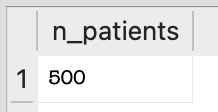
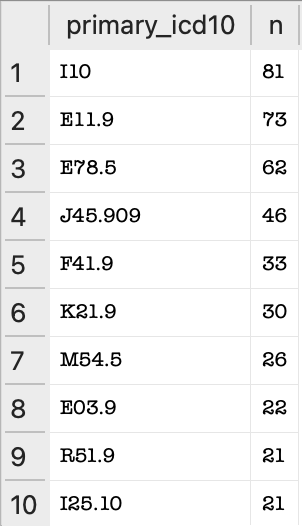
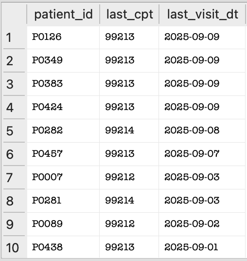
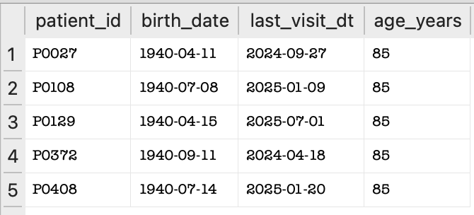

## Query Results Summary

---

## How to Run

1. Install dependencies:
   ```bash
   pip install -r requirements.txt
   ```
2. Create the database:
   ```bash
   python src/create_db.py
   ```
3. Import the patient data
   ```bash
   python src/import_csv.py
   ```
4. Open ```clinic_simple.db``` in DB Browser for SQLite and run the queries from ```sql/analysis.sql.```

The following queries were run on the `clinic_simple.db` SQLite database, which was created using Python and loaded with patient data from `patients.csv`. 

Each query explores different aspects of the dataset, such as total patients, common diagnoses, visit patterns, age distribution, and data quality.

### Query A — Row Count

This query counted how many patients are in the table.

**Query:**
```sql
SELECT COUNT(*) AS n_patients FROM patients;
```

**Result:**



**Explanation:**
There are 500 total patients in the dataset.
This confirms that all rows from the patients.csv file were successfully imported.

---

### Query B — Top primary diagnoses by count

This query counted how many patients had each ICD-10 diagnosis code.

**Query:**
```sql
SELECT primary_icd10, COUNT(*) AS n
FROM patients
GROUP BY primary_icd10
ORDER BY n DESC;
```

**Result:**



**Explanation:** 
The most common diagnosis is **I10 (Hypertension)**, followed by **E11.9 (Type 2 Diabetes)** and **E78.5 (High Cholesterol)**.


---

### Query C — Office-visit CPTs since Jan 1, 2025

This query listed patients who had CPT codes starting with 992 (office visits) since January 1, 2025.

**Query:**
```sql
SELECT patient_id, last_cpt, last_visit_dt
FROM patients
WHERE last_cpt LIKE '992%' AND last_visit_dt >= '2025-01-01'
ORDER BY last_visit_dt DESC;
```

**Result:**



**Explanation:**
This shows patients with recent office-visit CPT codes (992xx) since 2025.
Results are sorted by the most recent visit date.

---

### Query D — 5 oldest patients

This query calculated each patient's approximate age at their last visit and displayed the five oldest patients.

**Query:**
```sql
SELECT
  patient_id,
  birth_date,
  last_visit_dt,
  CAST((julianday(date('now')) - julianday(birth_date)) / 365.25 AS INT) AS age_years
FROM patients
ORDER BY age_years DESC
LIMIT 5;
```
**Result:**



**Explanation:**
This query finds the five oldest patients by calculating age from birth date.
It confirms that date fields and age calculations are working correctly.

---

### Query E — Data quality check for blank codes

This query looked for any rows where ICD-10 or CPT codes were missing (blank).

**Query:**
```sql
SELECT *
FROM patients
WHERE primary_icd10 = '' OR last_cpt = '';
```
**Result:**


**Explanation:**
This query checks for missing or incomplete data.
It returned 0 rows, confirming that the dataset contains no blank ICD-10 or CPT codes.
